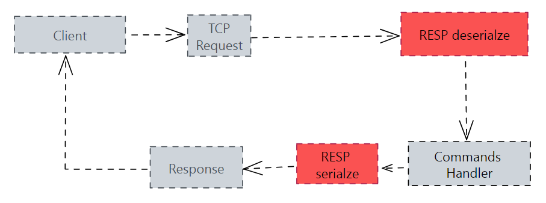
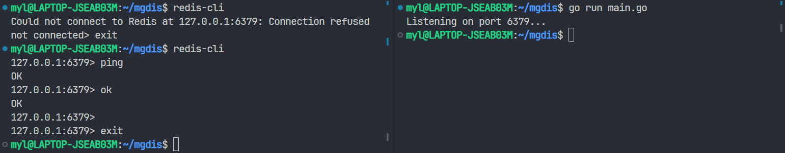
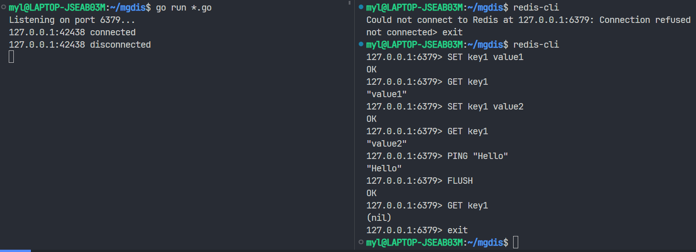

[toc]

# 概述

跟随 [Build Redis from scratch](https://www.build-redis-from-scratch.dev/en/introduction) 教程，记录下构建一个简单的内存数据库的步骤。代码放在 [这个](https://github.com/YoungFr/mgdis) 仓库。

```markdown
What I cannot create, I do not understand. - Richard Feynman
```

# 架构



# 准备工作

由于 Redis 不支持在 Windows 上运行，所以我们首先要安装 [WSL2](https://learn.microsoft.com/zh-cn/windows/wsl/)（**W**indows **S**ubsystem for **L**inux）。

安装完成后启动 Ubuntu 系统，依次输入下面 4 条命令来完成 Redis 的安装：

```bash
curl -fsSL https://packages.redis.io/gpg | sudo gpg --dearmor -o /usr/share/keyrings/redis-archive-keyring.gpg
echo "deb [signed-by=/usr/share/keyrings/redis-archive-keyring.gpg] https://packages.redis.io/deb $(lsb_release -cs) main" | sudo tee /etc/apt/sources.list.d/redis.list
sudo apt-get update
sudo apt-get install redis
```

安装成功后可以使用  `sudo service redis-server start` 命令来启动 Redis 服务器，然后输入 `redis-cli` 命令可以进入交互模式。在交互模式下我们可以输入一些命令并查看执行结果：

```bash
$ sudo service redis-server start
$ redis-cli
127.0.0.1:6379> ping
PONG
127.0.0.1:6379> exit
$ ...
```

Redis 是典型的一对多服务器程序：一个服务器可以与多个客户端建立网络连接。每个客户端都可以向服务器发送命令请求，服务器则接收并处理这些请求，然后向客户端返回命令回复。Redis 客户端和服务器之间使用 RESP（**RE**dis **S**erialization **P**rotocol）协议来通信。比如，客户端输入 `SET KEY VALUE` 命令后，会把它转换成下面的格式发送给服务器。

```
*3\r\n$3\r\nSET\r\n$3\r\nKEY\r\n$5\r\VALUE\r\n

*3   -> *3 表示长度为 3 的数组，所以接下来要读入 6 行。每两行表示一个元素：第一行是元素的类型；第二行是元素的值
$3   -> $3 表示一个长度为 3 的字符串，所以接下来的一行应该恰好包含 3 个字符
SET
$3
KEY
$5
VALUE
```

同样地，服务器执行成功后会产生一个 RESP 格式的回复 `+OK\r\n`（`+`表示这是一个不包含 `\r` 和 `\n` 的简单字符串）发送给客户端，客户端则将它转换为 `OK` 并打印出来。完整的 RESP 协议描述可以在 [官网](https://redis.io/docs/reference/protocol-spec/) 找到。

```
       1. type command            2. convert command to RESP format and send
user ------------------> client ---------------------------------------------> server
                                                                                 |
                                                                                 | 3. process
                                                                                 |
user <------------------ client <--------------------------------------------- server
   5. convert RESP format               4. send response with RESP format
  to human-readable format
```

接下来我们要构建的 Redis 其实是专指 Redis 服务器，我们会使用 Redis 自带的 `redis-cli` 客户端与其建立连接来测试它的功能。所以，我们要做的最后一项准备工作是使用 `sudo service redis-server stop` 命令关闭 Redis 服务器，因为我们的服务器也要监听 6379 端口。

```bash
$ sudo service redis-server stop
$ redis-cli
Could not connect to Redis at 127.0.0.1:6379: Connection refused
not connected> exit
$ ...
```

# 创建服务器

创建一个服务器监听 6379 端口，在一个无限循环中接收客户端发来的命令并向其发送一个 `+OK\r\n` 响应：

```go
func main() {
	fmt.Println("Listening on port 6379...")
	l, err := net.Listen("tcp", ":6379")
	if err != nil {
		log.Fatalln(err)
	}
	conn, err := l.Accept()
	if err != nil {
		log.Fatalln(err)
	}
	defer conn.Close()
	for {
		buf := make([]byte, 1024)
		_, err := conn.Read(buf)
		if err != nil {
			if err == io.EOF {
				break
			}
			log.Fatalf("reading from client error: %s\n", err.Error())
		}
		conn.Write([]byte("+OK\r\n"))
	}
}
```

运行效果：



# 接收和发送 RESP 协议消息

当用户在客户端键入一个命令请求时，这个命令请求会被转换成 RESP 格式然后通过套接字发送给服务器。服务器需要读取并解析这些字节流，将命令的类型和参数保存在 Go 结构体中等待后续的执行；当命令执行完成后，结果保存在 Go 结构体中，然后服务器将它序列化成字节流发送给客户端。

用于保存客户端的命令及服务器的执行结果的结构体定义如下：

```go
// 客户端的命令和服务器的执行结果都使用 Data 结构体来表示
// 字段 dataType 的值是 "SIMPLE_STRING"、"ERROR"、"INTEGER"、"BULK_STRING" 和 "ARRAY" 之一
// 剩余的字段根据 dataType 的值来相应地设置
// 客户端的命令 (命令名 + 参数) 总是被编码成一个多行字符串的数组
// 所以在解析客户端发来的消息时只需要处理 BULK_STRING 和 ARRAY 类型
// 服务器的执行结果则根据命令的不同可以是任何格式
type Data struct {
	dataType    string
	simpleStr   string
	errorMsg    string
	integer     int64
	bulkStr     string
	isNullBulk  bool
	array       []Data
	isNullArray bool
}
```

定义一个 `RESP` 结构体负责读取字节流并解析 `Data` 结构体以及将 `Data` 结构体写入套接字：

```go
// resp.go
type RESP struct {
	reader *bufio.Reader
	writer *bufio.Writer
}

func NewRESP(rwc io.ReadWriteCloser) *RESP {
	return &RESP{
		reader: bufio.NewReader(rwc),
		writer: bufio.NewWriter(rwc),
	}
}

// main.go
func handleConn(conn net.Conn) {
	defer conn.Close()
	...
	r := NewRESP(conn)
	...
}
```

然后定义 RESP 结构体的 `read` 和 `write` 方法：

```go
func (r *RESP) read() (data Data, err error) {
	dataType, err := r.reader.ReadByte()
	if err != nil {
		return data, err
	}
	switch dataType {
	case BULK_STRING:
		return r.readBulk()
	case ARRAY:
		return r.readArray()
	}
	return data, errUnknownRequestDataType
}

func (r *RESP) write(d Data) error { 
	if _, err := r.writer.Write(d.marshal()); err != nil {
		return err
	}
	// Don't forget to flush!
	if err := r.writer.Flush(); err != nil {
		return err
	}
	return nil
}
```

# 实现 SET 和 GET 命令

客户端的命令 (命令名 + 参数) 总是被编码成一个多行字符串的数组，其中第一个元素表示命令的类型，所以我们可以通过下面的代码获取字符串格式的命令的名字：

```go
req, err := r.read()
...
commandName := strings.ToUpper(req.array[0].bulkStr)
```

然后我们定义一个哈希表为每一种命令都定义一个对应的处理函数，就像下面这样：

```go
var handlers = map[string]func([]Data) Data{
	"SET": set,
	"GET": get,
}
```

所有的命令处理函数都有相同的函数签名 `func([]Data) Data` ，函数接收一个 `[]Data` 类型的参数数组，进行操作后返回一个 `Data` 结构体作为响应。

接下来定义哈希表用于存储所有的键值对并定义 `set` 和 `get` 处理函数：

```go
type Pairs struct {
	kv map[string]string
	mu sync.RWMutex
}

var p = Pairs{
	kv: make(map[string]string),
	mu: sync.RWMutex{},
}

// SET key value
func set(args []Data) Data {
	var reply Data
	switch len(args) {
	case 2:
		{
			k, v := args[0].bulkStr, args[1].bulkStr
			p.mu.Lock()
			p.kv[k] = v
			p.mu.Unlock()
			reply.dataType = datatypes[SIMPLE_STRING]
			reply.simpleStr = "OK"
		}
	default:
		{
			reply.dataType = datatypes[ERROR]
			reply.errorMsg = "ERR wrong number of arguments for 'set' command"
		}
	}
	return reply
}

// GET key
func get(args []Data) Data { ... }
```

在 `handleConn` 函数中将执行结果发送给客户端：

```go
if err := r.write(reply); err != nil {
	log.Fatalln(err)
}
```

执行结果：



# 实现 AOF 持久化机制

到目前为止，所有数据都存放在服务器的内存中，服务器一旦重启这些数据就会全部丢失。接下来我们使用 AOF 机制来实现数据的持久化。

AOF (**A**ppend-**O**nly **F**ile) 机制的思想是在服务器运行时保存其执行的写命令来记录数据库状态，服务器启动时会载入和执行 AOF 文件中的所有命令来还原服务器关闭之前的数据库状态。

定义一个 AOF 结构体，在 `NewAOF` 函数中启动一个 goroutine 定时将 AOF 文件中的内容持久化存储到磁盘中：

```go
type AOF struct {
	file *os.File
	mu   sync.Mutex
}

func NewAOF(path string) (*AOF, error) {
	f, err := os.OpenFile(path, os.O_CREATE|os.O_RDWR, 0666)
	if err != nil {
		return nil, err
	}
	aof := &AOF{
		file: f,
		mu:   sync.Mutex{},
	}
	go func() {
		for {
			aof.mu.Lock()
			aof.file.Sync()
			aof.mu.Unlock()
			time.Sleep(1 * time.Second)
		}
	}()
	return aof, nil
}
```

为 AOF 结构体定义一个 `write` 方法，每当服务器要执行的命令是写入命令时，先将这个命令保存到 AOF 文件中：

```go
// aof.go
func (a *AOF) write(req Data) error {
	a.mu.Lock()
	defer a.mu.Unlock()
	_, err := a.file.Write(req.marshal())
	if err != nil {
		return err
	}
	return nil
}
// main.go
var writingCommands = map[string]bool{
	"SET": true,
}

if handler, ok := handlers[commandName]; ok {
    if writingCommands[commandName] {
        aof.write(req)
    }
    reply = handler(args)
    ...
}
```

再定义一个 `read` 方法，每次服务器启动时先读入 AOF 文件中的所有命令并依次执行一遍：

```go
// aof.go
func (a *AOF) read() ([]Data, error) {
	a.mu.Lock()
	defer a.mu.Unlock()
	a.file.Seek(0, io.SeekStart)
	ds := make([]Data, 0)
	r := NewRESP(a.file)
	for {
		d, err := r.read()
		if err != nil {
			if err == io.EOF {
				break
			}
			return nil, err
		}
		ds = append(ds, d)
	}
	return ds, nil
}

// main.go
aof, err := NewAOF("db.aof")
if err != nil {
    log.Fatalln(err)
}
defer aof.close()
if commands, err := aof.read(); err != nil {
    log.Fatalln(err)
} else {
    for _, command := range commands {
        handlers[strings.ToUpper(command.array[0].bulkStr)](command.array[1:])
    }
}
```

这样我们就实现了数据库的持久化储存。

