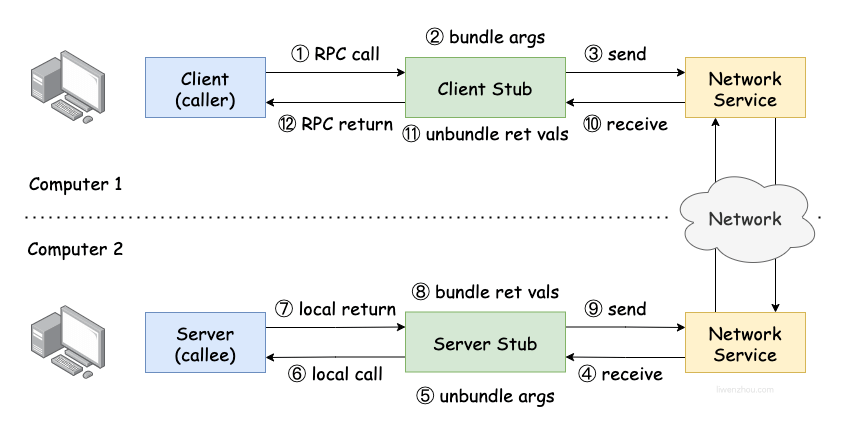

[toc]

# 1. Introduction —— 导论

什么是分布式系统？

> A group of computers cooperating to provide a service.

为什么要研究？

并行处理、增加容错、匹配物理设备本身的分布性、安全......

### 1.1 Main Topics

总体目标 —— **hide the complexity of distribution from applications**.

**性能(performance)**：通过增加并行的机器数来增加吞吐量，但面临负载失衡、最大延迟和部分事情不能并行化的问题。

**容错(fault tolerance)**：通过重复的机器使得在部分机器失效的情况下，系统仍然能够正常地提供服务。

**一致性(consistency)**：容错会导致一致性问题，即如何让重复的机器中的内容保持一致。

**权衡(tradeoffs)**：上述三者不可能同时做到完美，需要在上述三者之间达到一种平衡。即[CAP理论](https://cloud.tencent.com/developer/article/1860632)。

**实现(implementation)**：用到的技术包括 RPC、线程和并发控制等。

# 2. Threads and RPC —— 构建分布式系统的工具

### 2.1 Threads

使用线程的原因：实现 I/O 并发、利用多核性能、方便信息共享。

线程的替代品：[**事件驱动(event-driven)**](https://quix.io/blog/what-why-how-of-event-driven-programming)编程。但是这种编程模式不能利用多核性能，而多线程的主要挑战在于如何安全地共享数据以及如何实现线程间的协作。

### 2.2 Threads Example

串行化的 Web 爬虫：

```go
func Serial(url string, fetcher Fetcher, fetched map[string]bool) {
	if fetched[url] {
		return
	}
	fetched[url] = true
	urls, err := fetcher.Fetch(url)
	if err != nil {
		return
	}
	for _, u := range urls {
		// 仅仅在 Serial 之前加 go 关键字是错误的
		// 这只是启动了 goroutine 但没有等待它完成
		Serial(u, fetcher, fetched)
	}
}

// main function
Serial("http://golang.org/", fetcher, make(map[string]bool))
```

使用共享状态和互斥量的 Web 爬虫：

```go
// 所有 goroutine 共享同一个 fetched 哈希表
// 使用锁来保护它
type fetchState struct {
	mu      sync.Mutex
	fetched map[string]bool
}

func makeState() *fetchState {
	return &fetchState{fetched: make(map[string]bool)}
}

// 如果线程 T1 和 T2 使用同一个 url 读取 fetched[url] 的值
// 假设这个 url 还没有被访问过 => 线程 T1 和 T2 都读到 false 值
// 两个线程就会对同一个 url 进行 Fetch 调用
func (fs *fetchState) testAndSet(url string) bool {
	fs.mu.Lock()
	defer fs.mu.Unlock()
	r := fs.fetched[url]
	fs.fetched[url] = true
	return r
}

func ConcurrentMutex(url string, fetcher Fetcher, fs *fetchState) {
	if fs.testAndSet(url) {
		return
	}
	urls, err := fetcher.Fetch(url)
	if err != nil {
		return
	}
	// 使用 sync.WaitGroup 等待所有 goroutine 结束
	var done sync.WaitGroup
	for _, url := range urls {
		done.Add(1)
		u := url
		go func(u string) {
			defer done.Done()
			ConcurrentMutex(u, fetcher, fs)
		}(u)
	}
	done.Wait()
}

// main function
ConcurrentMutex("http://golang.org/", fetcher, makeState())
```

使用管道的 Web 爬虫：

```go
// main function
ConcurrentChannel("http://golang.org/", fetcher)

func ConcurrentChannel(url string, fetcher Fetcher) {
	// 无缓冲管道
	ch := make(chan []string)
	go func() {
		// 无缓冲管道的发送操作会阻塞
		// 直到另一个 goroutine 在对应的通道上执行接收操作
		ch <- append([]string(nil), url)
	}()
	coordinator(ch, fetcher)
}

func coordinator(ch chan []string, fetcher Fetcher) {
	n := 1
	fetched := make(map[string]bool)
	// 如果接收操作先执行
	// 接收方 goroutine 会阻塞直到另一个 goroutine 发送一个值
	for urls := range ch {
		for _, u := range urls {
			if !fetched[u] {
				fetched[u] = true
				n += 1
				go worker(u, ch, fetcher)
			}
		}
		n -= 1
		if n == 0 {
			break
		}
	}
}

func worker(url string, ch chan []string, fetcher Fetcher) {
	urls, err := fetcher.Fetch(url)
	if err != nil {
		ch <- make([]string, 0)
	} else {
		ch <- urls
	}
}
```

### 2.3 RPC

RPC 是指 [**远程过程调用(Remote Procedure Call**)](https://www.zhihu.com/question/25536695/answer/221638079) 。它通常使用在分布式系统中，使得一个节点可以通过网络请求的方式来调用另一个节点提供的服务，图片来自 [这里](https://www.liwenzhou.com/posts/Go/rpc/) 。



使用 RPC 实现的简单的 K/V 存储：

```go
// Common Declarations

type PutArgs struct {
	Key   string
	Value string
}

type PutReply struct{}

type GetArgs struct {
	Key string
}

type GetReply struct {
	Value string
}

// Client

func connect() *rpc.Client {
	// 创建到 RPC 服务器的 TCP 连接
	client, err := rpc.Dial("tcp", ":1234")
	if err != nil {
		log.Fatal("dialing:", err)
	}
	return client
}

// 函数 put 和 get 都是 client stub (客户端存根)
// 客户端存根负责将请求参数打包成网络消息发送给服务方
// 以及接收表示结果的消息并进行解码

func get(key string) string {
	client := connect()
	args := GetArgs{
		Key: key,
	}
	reply := GetReply{}
	err := client.Call("KV.Get", &args, &reply)
	if err != nil {
		log.Fatal("error:", err)
	}
	client.Close()
	return reply.Value
}

func put(key string, val string) {
	client := connect()
	args := PutArgs{
		Key:   key,
		Value: val,
	}
	reply := PutReply{}
	err := client.Call("KV.Put", &args, &reply)
	if err != nil {
		log.Fatal("error:", err)
	}
	client.Close()
}

// Server

type KV struct {
	mu   sync.Mutex
	data map[string]string
}

func (kv *KV) Get(args *GetArgs, reply *GetReply) error {
	kv.mu.Lock()
	defer kv.mu.Unlock()
	reply.Value = kv.data[args.Key]
	return nil
}

func (kv *KV) Put(args *PutArgs, reply *PutReply) error {
	kv.mu.Lock()
	defer kv.mu.Unlock()
	kv.data[args.Key] = args.Value
	return nil
}

func server() {
	// 需要声明一个某种类型的对象用于注册 RPC 服务
	kv := &KV{
		data: make(map[string]string),
	}
	rpcs := rpc.NewServer()
	rpcs.Register(kv)

	l, e := net.Listen("tcp", ":1234")
	if e != nil {
		log.Fatal("listen error:", e)
	}
	go func() {
		for {
			// 等待连接请求
			// 并为每个连接请求创建一个 goroutine 来处理
			conn, err := l.Accept()
			if err == nil {
				go rpcs.ServeConn(conn)
			} else {
				break
			}
		}
		l.Close()
	}()
}

func main() {
	server()

	put("subject", "6.5840")
	fmt.Printf("Put(subject, 6.5840) done\n")
	fmt.Printf("get(subject) -> %s\n", get("subject"))
}
```

# Lab 1 —— MapReduce

谷歌公司的 MapReduce 是一个用于处理和生成**大数据集(large data sets)**的**编程模型(programming model)**。用户只需要定义自己的 `map` 和 `reduce` 函数即可，其余的事情则都交由运行时系统管理，这些事情包括切分输入数据、程度执行调度、处理机器失效和机器间通信。这个模型可以使用户高效地利用大型分布式系统的并行性和其他各种资源。

### Getting Started

作者提供了一个顺序版本的 MapReduce 实现，即在单个进程中顺序运行 `map` 和 `reduce` 函数。这个版本可以通过以下几条命令来运行：

```bash
$ cd ~/6.5840
$ cd src/main
$ go build -buildmode=plugin ../mrapps/wc.go
$ rm mr-out*
$ go run mrsequential.go wc.so pg*.txt
$ more mr-out-0
```

命令 `go build -buildmode=plugin ../mrapps/wc.go` 会将 `wc.go` 编译为共享库（`.so`）的形式。运行完这条命令后，文件夹 `src/main` 下就会产生一个 `wc.so` 文件，后续主程序在运行时可以动态加载这个文件并提取出其中导出的函数和变量来使用。文件 `wc.go` 的内容如下：

```go
// 注意：要编译为共享库的文件必须放在 main 包中
package main

import ...

// 结构体 KeyValue 定义在 src/mr 文件夹中
type KeyValue struct {
	Key   string
	Value string
}

func Map(filename string, contents string) []mr.KeyValue {
	// 函数 ff 判断一个字符是否为单词分隔符
	ff := func(r rune) bool { return !unicode.IsLetter(r) }
	// 将字符串分解为单词列表
	words := strings.FieldsFunc(contents, ff)
	kva := make([]mr.KeyValue, 0)
	for _, word := range words {
		// 针对单词列表中的每个单词都生成 [word -> "1"] 键值对
		// 函数 Map 返回的是所有单词组成的键值对列表
		kv := mr.KeyValue{Key: word, Value: "1"}
		kva = append(kva, kv)
	}
	return kva
}

func Reduce(key string, values []string) string {
	return strconv.Itoa(len(values))
}
```

然后通过命令 `go run mrsequential.go wc.so pg*.txt` 来运行主程序。文件 `mrsequential.go` 中首先有一个函数 `loadPlugin` 用于加载 `map` 和 `reduce` 函数：

```go
// 共享库 Go Plugin 的详细使用可以参见 https://pkg.go.dev/plugin
// 现在我们需要知道 Lookup 返回的是一个 Symbol 类型的值
// 而 Symbol 的底层类型 any 是一个某种类型的变量的指针或是一个函数
// 所以可以使用类型断言来获取它持有的动态值
func loadPlugin(filename string) (func(string, string) []mr.KeyValue, 
                                  func(string, []string) string) {
	p, err := plugin.Open(filename)
	if err != nil {
		log.Fatalf("cannot load plugin %v", filename)
	}
	xmapf, err := p.Lookup("Map")
	if err != nil {
		log.Fatalf("cannot find Map in %v", filename)
	}
	mapf := xmapf.(func(string, string) []mr.KeyValue)
	xreducef, err := p.Lookup("Reduce")
	if err != nil {
		log.Fatalf("cannot find Reduce in %v", filename)
	}
	reducef := xreducef.(func(string, []string) string)
	return mapf, reducef
}
```

然后是负责执行 `map` 和 `reduce` 过程的 `main` 函数：

```go
type ByKey []mr.KeyValue
// 实现排序接口使得 []mr.KeyValue 能够按 Key 排序
func (a ByKey) Len() int           { return len(a) }
func (a ByKey) Swap(i, j int)      { a[i], a[j] = a[j], a[i] }
func (a ByKey) Less(i, j int) bool { return a[i].Key < a[j].Key }

func main() {
	if len(os.Args) < 3 {
		fmt.Fprintf(os.Stderr, "Usage: mrsequential xxx.so inputfiles...\n")
		os.Exit(1)
	}
	// 动态加载 map 和 reduce 函数
	mapf, reducef := loadPlugin(os.Args[1])
	// 存放中间结果（由函数 mapf 生成）的列表
	intermediate := []mr.KeyValue{}
	for _, filename := range os.Args[2:] {
		// 打开并读取一个文件的全部内容
		// 忽略错误处理
		file, _ := os.Open(filename)
		content, _ := io.ReadAll(file)
		file.Close()
		// 针对每个文件生成的 [word -> "1"] 键值对列表都添加到 intermediate 中
		kva := mapf(filename, string(content))
		intermediate = append(intermediate, kva...)
	}
	// 把中间结果按照键的大小排序
	// 课程中的例子如下
	// intermediate = [["a", "1"], ["b", "1"], ["b", 1], ["c", "1"], ["a", "1"]]
	//                 |       file 1       |  |file 2|  |       file 3       |
	// intermediate = [["a", "1"], ["a", "1"], ["b", 1], ["b", "1"], ["c", "1"]]
	sort.Sort(ByKey(intermediate))
    
	oname := "mr-out-0"
	ofile, _ := os.Create(oname)

	i := 0
	for i < len(intermediate) {
		j := i + 1
		for j < len(intermediate) && intermediate[j].Key == intermediate[i].Key {
			j++
		}
		values := make([]string, 0)
		// 执行到这里时区间 [i, j-1] 中的所有键值对都有相同的键
		// 所以 values = ["1", "1", ..., "1"] 共有 j-i 个元素
		for k := i; k < j; k++ {
			values = append(values, intermediate[k].Value)
		}
		// 函数 reducef 直接返回 values 的长度
		// 对应的就是 intermediate[i].Key 这个单词出现的次数
		output := reducef(intermediate[i].Key, values)
		fmt.Fprintf(ofile, "%v %v\n", intermediate[i].Key, output)
		i = j
	}
	ofile.Close()
}
```

