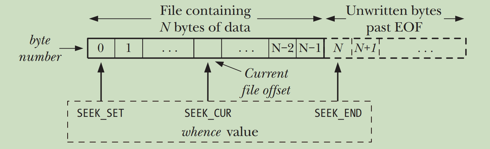

[toc]

# Linux I/O

# 1. File I/O

文件是 Unix 哲学的中心思想，本节聚焦于磁盘文件的 I/O 。

所有和 I/O 相关的系统调用都使用**文件描述符(file descriptor)**来指代打开的文件，这些文件包括管道、FIFO、套接字、终端、设备和普通文件。<font color=red>**每个进程都有它自己的打开的文件描述符的集合**</font>。在 shell 的日常操作中，标准输入（`STDIN_FILENO`）、标准输出（`STDOUT_FILENO`）和标准错误（`STDERR_FILENO`）这三个文件描述符始终是打开的。所以通过 shell 启动的程序也会继承打开这三个文件描述符。

文件操作的主要系统调用是 `fd = open(pathname, flags, mode)` 、`numread = read(fd, buffer, count)` 、`numwritten = write(fd, buffer, count)` 和 `status = close(fd)` 。文件 `copy.c` 使用这 4 个系统调用实现了一个简化的 [`cp(1)`](https://man7.org/linux/man-pages/man1/cp.1.html) 命令。

```
PS：手册页中的命令、系统调用、库函数等名字后边的小括号中的数字表示它归属于哪一个章节
1 - 用户命令(user commands)
2 - 系统调用(system calls)
3 - 库函数(library functions)
4 - 设备(special files)
5 - 文件格式和文件系统(file formats and filesystems)
6 - 游戏(games)
7 - 杂项(overview and miscellany section)
8 - 系统管理员工具(administration and privileged commands)
```

```c
// copy.c
#include <sys/stat.h>
#include <fcntl.h>
#include "tlpi_hdr.h"

#ifndef BUF_SIZE
#define BUF_SIZE 1024
#endif

int main(int argc, char *argv[])
{
    if (argc != 3 || strcmp(argv[1], "--help") == 0)
        usageErr("%s old-file new-file\n", argv[0]);
    
    int inputFd = open(argv[1], O_RDONLY);
    if (inputFd == -1)
        errExit("opening file %s", argv[1]);

    int    openFlags = O_CREAT | O_WRONLY | O_TRUNC;
    mode_t filePerms = S_IRUSR | S_IWUSR  | 
                       S_IRGRP | S_IWGRP  |
                       S_IROTH | S_IWOTH; /* rw-rw-rw- */
    int outputFd = open(argv[2], openFlags, filePerms);
    if (outputFd == -1)
        errExit("opening file %s", argv[2]);

    /* Transfer data until we encounter end of input or an error */

    ssize_t numRead;
    char buf[BUF_SIZE];
    while ((numRead = read(inputFd, buf, BUF_SIZE)) > 0)
        if (write(outputFd, buf, numRead) != numRead)
            fatal("write() returned error or partial write occurred");
    if (numRead == -1)
        errExit("read");

    if (close(inputFd) == -1)
        errExit("close input");
    if (close(outputFd) == -1)
        errExit("close output");

    exit(EXIT_SUCCESS);
}
```

## 1.1 打开和关闭文件：`open` 和 `close` 系统调用

系统调用 [`open`](https://man7.org/linux/man-pages/man2/open.2.html#DESCRIPTION) 用于打开一个已经存在的文件或创建并打开一个不存在的文件：

```c
#include <sys/stat.h>
#inclide <fcntl.h>
/* mode_t: type of file attribute bitmasks */
int open(const char *pathname, int flags, ... /* mode_t mode */);
```

参数 `flags` 用于指定文件的**访问模式(access mode)**，可选的值被划分为三组：**文件访问模式标志(file access mode flags)**（`O_RDONLY`, `O_WRONLY`, `O_RDWR`）、**文件创建标志(file creation flags)**（`O_CLOEXEC`, `O_CREAT`, `O_DIRECTORY`, `O_EXCL`, `O_NOCTTY`, `O_NOFOLLOW`, `O_TMPFILE`, `O_TRUNC`）和**文件状态标志(file status flags)**（`O_APPEND`, `O_ASYNC`, `O_DIRECT`, `O_DSYNC`, `O_LARGEFILE`, `O_NOATIME`, `O_NONBLOCK`或`O_NDELAY`, `O_PATH`, `O_SYNC`）。<font color=red>**参数 `flags` 必须指定且只能指定一个文件访问模式标志**</font>，剩余两组中的值则可以指定零个或多个。

参数 `mode` 用于指定创建一个新文件时的**访问权限(permissions)**，这个参数只在 `flags` 指定了 `O_CREAT` 或 `O_TMPFILE` 时有效（此时必须设置 `mode` 参数，否则编译会报错），可选的值及含义见 [这里](https://man7.org/linux/man-pages/man2/open.2.html#DESCRIPTION) 。要注意的是文件的访问权限不仅依赖于参数 `mode` 的值，还受到进程的 `umask` 值和（可能存在的）父目录的默认访问控制列表的影响。

调用成功时 `open` 返回一个文件描述符，<font color=red>**且保证是当前进程未使用的文件描述符中的最小者**</font>。调用失败时返回 -1 且会将 [`errno`](https://man7.org/linux/man-pages/man3/errno.3.html) 设置为 [相应的错误标志](https://man7.org/linux/man-pages/man2/open.2.html#ERRORS) 。

> PS：在早期的 UNIX 实现中，`open` 只有两个参数且不能用于新建文件。系统调用 `creat(pathname, mode)` 专门用于创建并打开一个新文件，它等价于调用 `open(pathname, O_CREAT | O_WRONLY | O_TRUNC, mode)` 。但是由于 `open` 对文件的打开方式控制更加灵活，所以现在已很少使用 `creat` 系统调用。

系统调用 [`close`](https://man7.org/linux/man-pages/man2/close.2.html#DESCRIPTION) 用于关闭一个打开的文件描述符：

```c
#include <fcntl.h>

int close(int fd);
```

调用成功时返回 0，调用失败时返回 -1 且会将 [`errno`](https://man7.org/linux/man-pages/man3/errno.3.html) 设置为 [相应的错误标志](https://man7.org/linux/man-pages/man2/close.2.html#ERRORS) 。虽然<font color=red>**当进程退出时其打开的所有文件描述符都会被自动关闭**</font>，但是显式关闭不再需要的文件描述符是一个良好的编程习惯。因为文件描述符是一种有限资源，关闭失败可能会导致一个进程将其消耗殆尽。下面的代码可以捕获企图关闭未打开的文件描述符、两次关闭同一文件描述符和其他各种错误：

```c
if (close(fd) == -1)
    errExit("close");
```

## 1.2 读写文件：`read` 和 `write` 系统调用

系统调用 [`read`](https://man7.org/linux/man-pages/man2/read.2.html#DESCRIPTION) 用于从文件描述符 `fd` 指代的文件中读取数据：

```c
#include <unistd.h>
/* ssize_t: type of a byte count, or error */
ssize_t read(int fd, void *buffer, size_t count);
```

参数 `count` 用于指定最多能读取的字节数。参数 `buffer` 表示用来存放读入的数据的内存缓冲区的地址，<font color=red>**缓冲区的长度至少应该是 `count` 个字节且必须预先分配**</font>。

读操作会从**文件偏移量(file offset)**（1.3节）开始。调用成功时返回实际读取的字节数<font color=red>并且文件位置偏移量会增加相应的大小</font>，实际读取的字节数小于 `count` 是可能的（比如读取的位置靠近文件尾部），这并不是一个错误；如果文件偏移量位于或越过了 `SEEK_END` 位置（1.3节）调用返回 0；调用失败会返回 -1 并将 [`errno`](https://man7.org/linux/man-pages/man3/errno.3.html) 设置为 [相应的错误标志](https://man7.org/linux/man-pages/man2/read.2.html#ERRORS) ，<font color=red>在这种情况下，文件偏移量是否发生了改变是不确定的</font>。

系统调用 [`write`](https://man7.org/linux/man-pages/man2/write.2.html#DESCRIPTION) 用于将数据写入一个打开的文件中：

```c
#include <unistd.h>

ssize_t write(int fd, const void *buffer, size_t count);
```

参数的含义和 `read` 是类似的。写操作同样从文件偏移量开始。调用成功时返回实际写入的字节数并且文件偏移量增加相应的大小，注意：<font color=red>**如果在打开文件时使用了 `O_APPEND` 文件状态标志，在每次写入前会首先将文件偏移量移动到 `SEEK_END`位置，且文件偏移量的调整和写操作被合并为一个原子操作**</font>（2.1节）。同样地，实际写入的字节数小于 `count` 也是可能的。调用失败时返回 -1 并将 [`errno`](https://man7.org/linux/man-pages/man3/errno.3.html) 设置为 [相应的错误标志](https://man7.org/linux/man-pages/man2/write.2.html#ERRORS) 。

最后要注意的是：<font color=red>**`write` 调用成功并不能保证数据已经写入磁盘**</font>。这是因为文件 I/O 使用了内核缓冲（3.1节），唯一保证数据被写入磁盘的方式是在写完所有数据后使用 `fsync` 系统调用。

## 1.3 改变文件偏移量： `lseek` 系统调用

对于每一个打开的文件，内核会记录其**文件偏移量(file offset, read-write offset or pointer)**，它是执行下一个 `read` 或 `write` 操作的起始位置。文件第一个字节的偏移量为 0，每次打开文件时都会将文件偏移量设置为指向文件开始。使用 [`lseek`](https://man7.org/linux/man-pages/man2/lseek.2.html#DESCRIPTION) 系统调用可以调整文件偏移量：

```c
#include <unistd.h>
/* off_t: type of file sizes and offsets */
off_t lseek(int fd, off_t offset, int whence);
```

调整后的文件偏移量是将参数 `whence` 所指代的文件偏移量的值和 `offset` 的值相加：

```
whence == SEEK_SET -> 0 + offset
whence == SEEK_CUR -> current file offset + offset
whence == SEEK_END -> size of file + offset
(从 Linux 3.1 开始增加了 SEEK_DATA 和 SEEK_HOLE 选项，它们和文件空洞有关)
```



调用成功时返回新的文件偏移量，所以可以通过 `curr = lseek(fd, 0, SEEK_CUR)` 获取当前的文件偏移量。调用失败时返回 -1 并将 [`errno`](https://man7.org/linux/man-pages/man3/errno.3.html) 设置为 [相应的错误标志](https://man7.org/linux/man-pages/man2/lseek.2.html#ERRORS) 。

下面是 `lseek` 的一些使用示例：

```c
lseek(fd,   0, SEEK_SET); /* Start of file */
lseek(fd,   0, SEEK_END); /* Next byte after the end of the file */
lseek(fd,  -1, SEEK_END); /* Last byte of file */
lseek(fd, 100, SEEK_END); /* 101 bytes past last byte of file */
```

<font color=red>**调用 `lseek` 只是调整了内核中和文件描述符相关的文件偏移量记录，而没有任何对物理设备的访问**</font>。还要注意 `lseek` 不适用于所有类型的文件：不允许将其用于管道、FIFO、套接字和终端，否则会调用失败并将 `errno` 设为 `ESPIPE` 。另一方面，`lseek` 也可以用于设备，但标准并没有规定哪些设备必须支持 `lseek` 操作。

### 文件空洞（file holes）

如果文件的文件偏移量跨过了 `SEEK_END` 所指代的位置，对 `read` 的调用会返回 0，<font color=red>**但是调用 `write` 却可以向文件结尾后的任意位置写入数据**</font>。从文件结尾后到新写入数据之间的这段空间被称为**文件空洞(file holes)**，对空洞的读取会返回空字节（`'\0'`）。文件空洞（准确来说是完全落在块内的空洞，详见文件系统）不占用任何磁盘空间，直到后续向空洞中写入数据时，文件系统才会为其分配磁盘块。这就导致了<font color=red>**一个文件名义上的大小可能要比其实际占用的磁盘空间要大（甚至是大得多）**</font>。

## 1.4 `read`、`write` 和 `lseek` 的应用示例

```c
/* seek_io.c
   Usage: seek_io file {r<length>|R<length>|w<string>|s<offset>}...

   This program opens the file named on its command line, and then performs
   the file I/O operations specified by its remaining command-line arguments:

           r<length>    Read 'length' bytes from the file at current
                        file offset, displaying them as txt.

           R<length>    Read 'length' bytes from the file at current
                        file offset, displaying them in hex.

           w<string>    Write 'string' at current file offset.

           s<offset>    Set the file offset to 'offset'.
*/
#include <sys/stat.h>
#include <fcntl.h>
#include <ctype.h>
#include "tlpi_hdr.h"

int main(int argc, char *argv[])
{
    if (argc < 3 || strcmp(argv[1], "--help") == 0)
        usageErr("%s file {r<length>|R<length>|w<string>|s<offset>}...\n", argv[0]);
    
    int fd = open(argv[1], O_RDWR | O_CREAT,
                S_IRUSR | S_IWUSR | 
                S_IRGRP | S_IWGRP |
                S_IROTH | S_IWOTH); /* rw-rw-rw- */
    if (fd == -1)
        errExit("open");

    size_t len;
    off_t  offset;
    unsigned char *buf;
    ssize_t numRead, numWritten;

    for (int ap = 2; ap < argc; ap++) {
        switch (argv[ap][0]) {
        case 'r':   /* Display bytes at current offset, as txt */
        case 'R':   /* Display bytes at current offset, in hex */
            len = getLong(&argv[ap][1], GN_ANY_BASE, argv[ap]);

            buf = malloc(len);
            if (buf == NULL)
                errExit("malloc");
            numRead = read(fd, buf, len);
            if (numRead == -1)
                errExit("read");

            if (numRead == 0) {
                printf("%s: end-of-file\n", argv[ap]);
            } else {
                printf("%s: ", argv[ap]);
                for (int j = 0; j < numRead; j++) {
                    if (argv[ap][0] == 'r') {
                        printf("%c", isprint(buf[j]) ? buf[j] : '?');
                    } else {
                        printf("%02x ", buf[j]);
                    }
                }
                printf("\n");
            }
            free(buf);
            break;
        case 'w':   /* Write string at current offset */
            numWritten = write(fd, &argv[ap][1], strlen(&argv[ap][1]));
            if (numWritten == -1)
                errExit("write");
            printf("%s: wrote %ld bytes\n", argv[ap], (long) numWritten);
            break;
        case 's':   /* Change file offset */
            offset = getLong(&argv[ap][1], GN_ANY_BASE, argv[ap]);
            if (lseek(fd, offset, SEEK_SET) == -1)
                errExit("lseek");
            printf("%s: seek succeeded\n", argv[ap]);
            break;
        default:
            cmdLineErr("Argument must start with [rRws]: %s\n", argv[ap]);
        }
    }

    if (close(fd) == -1)
        errExit("close");
    exit(EXIT_SUCCESS);
}
```

## 1.5 通用 I/O 模型以外的操作：`ioctl` 系统调用

系统调用 [`ioctl`](https://man7.org/linux/man-pages/man2/ioctl.2.html#DESCRIPTION) 用于访问文件系统或设备的专有功能：

```c
#include <sys/ioctl.h>

int ioctl(int fd, unsigned long request, ...);
```

TODO ...

# 2. File I/O Details

## 2.1 原子性和竞争条件

<font color=red>**所有系统调用都是以原子操作的方式执行的**</font>，内核会保证一个系统调用的所有操作步骤都会一次性执行完成，期间不会被其他进程或线程中断。原子性的存在规避了**竞争条件(race condition or race hazard)**，即<font color=red>**操作共享资源的两个进程的执行结果取决于它们获得 CPU 使用权的先后顺序**</font>。

接下来展示两个文件 I/O 中竞争条件的例子以及如何在打开文件指定合适的访问模式（1.1节）来消除竞争条件。

第一个例子尝试使用下面的错误代码来独占地打开一个文件：

```c
// bad code!!!
fd = open(argv[1], O_WRONLY);       /* Check if file exists */
if (fd != -1) {                     /* Open succeeded */
    printf("[PID %ld] File \"%s\" already exists\n", (long) getpid(), argv[1]);
    close(fd);
} else {
    if (errno != ENOENT) {          /* Failed for unexpected reason */
        errExit("open");
    } else {
        /* 竞争条件产生的地方 */
        fd = open(argv[1], O_WRONLY | O_CREAT, S_IRUSR | S_IWUSR);
        if (fd == -1)
            errExit("open");
        printf("[PID %ld] Created file \"%s\" exclusively\n", (long) getpid(), argv[1]);
    }
}
```

进程 A 在第 3-5 行检查文件是否存在，如果不存在则创建并打开它。但是当它执行到第 10 行时，内核调度器可能会判断出进程 A 时间片用尽并将 CPU 使用权交给 B 进程。假设 B 进程也执行了 `fd = open(argv[1], O_WRONLY | O_CREAT, S_IRUSR | S_IWUSR);` 操作，随后 B 进程时间片用尽并将 CPU 再次交给 A 进程，此时执行第 11 行必然成功。于是 A 进程认为自己创建了该文件，但实际上该文件是由 B 进程创建的。

问题在于 A 进程的检查和创建文件不是原子操作，通过使用 `O_EXCL` 文件创建标志可以将检查和创建文件纳入同一原子操作，它保证了确实是当前的 `open` 调用创建了文件，如果文件已经存在会调用失败并将 `errno` 设为 `EEXIST`。

第二个例子是在多个进程中执行以下操作向同一个文件写入数据：

```c
// bad code!!!
if (lseek(fd, 0, SEEK_END) == -1)
    errExit("lseek");
/* 竞争条件产生的地方 */
if (write(fd, buf, len) != len)
    fatal("partial/failed write");
```

以 `A(2,3) -> B(2,3) -> B(5,6) -> A(5,6)` 的顺序执行，A 进程会将 B 进程写入的数据覆盖。通过使用 `O_APPEND` 文件状态标志可以将改变文件偏移量和写操作纳入同一原子操作。

## 2.2 文件控制：`fcntl` 系统调用

系统调用 [`fcntl`](https://man7.org/linux/man-pages/man2/fcntl.2.html#DESCRIPTION) 用于对一个打开的文件描述符执行控制操作：

```c
#include <fcntl.h>

int fcntl(int fd, int cmd, ... /* arg */);
```

要执行的操作类型和可选的第三个参数都是由参数 `cmd` 控制的。调用成功时的 [返回值](https://man7.org/linux/man-pages/man2/fcntl.2.html#RETURN_VALUE) 取决于操作类型，调用失败时返回 -1 并将 [`errno`](https://man7.org/linux/man-pages/man3/errno.3.html) 设置为 [相应的错误标志](https://man7.org/linux/man-pages/man2/fcntl.2.html#ERRORS) 。

`fcntl` 支持的操作非常多。其中之一是获取或修改一个文件的访问模式标志（`O_RDONLY`, `O_WRONLY`, `O_RDWR`）和文件状态标志（`O_APPEND`, `O_ASYNC`, `O_DIRECT`, `O_DSYNC`, `O_LARGEFILE`, `O_NOATIME`, `O_NONBLOCK`或`O_NDELAY`, `O_PATH`, `O_SYNC`）。

获取时要将第二个参数设为 `F_GETFL` 且不需要第三个参数。对于文件状态标志，应该将返回值和要判断的值相与；对于访问模式标志，要先将返回值和 `O_ACCMODE` 相与，然后再和要判断的值比较：

```c
int flags, accessMode;
flags = fcntl(fd, F_GETFL);
if (flags == -1)
    errExit("fcntl");
if (flags & O_APPEND)
    printf("append only\n");
if ((accessMode = flags & O_ACCMODE) == O_RDWR)
    printf("readable and writable\n");
```

如果将第二个参数设为 `F_SETFL` 则可以修改打开文件的状态标志。在 Linux 上只允许设置 `O_APPEND`, `O_ASYNC`, `O_DIRECT`, `O_NOATIME` 和 `O_NONBLOCK` 这几个值（但在其他 UNIX 实现中设置 `O_SYNC` 也是可能的），具体做法是先获取当前标志的副本，修改需要设置的标志后调用 `F_SETFL` 命令：

```c
int flags;
if ((flags = fcntl(fd, F_GETFL)) == -1)
    errExit("fcntl get flags");
flags |= O_APPEND;
if (fcntl(fd, F_SETFL, flags) == -1)
    errExit("fcntl set flags");
```

设置文件状态标志非常适用于文件不是由当前进程打开以及文件描述符是通过 `pipe` 或 `socket` 等系统调用获得时的情况。

## 2.3 文件描述符和打开文件之间的关系

TODO

## 2.4 复制文件描述符：`dup`、`dup2` 和 `dup3` 系统调用

TODO

## 2.5 在特定文件偏移量处的 I/O：`pread` 和 `pwrite` 系统调用

TODO

## 2.6 分散输入和集中输出：`readv` 和 `writev` 系统调用

TODO

## 2.7 截断文件：`truncate` 和 `ftruncate` 系统调用

TODO

