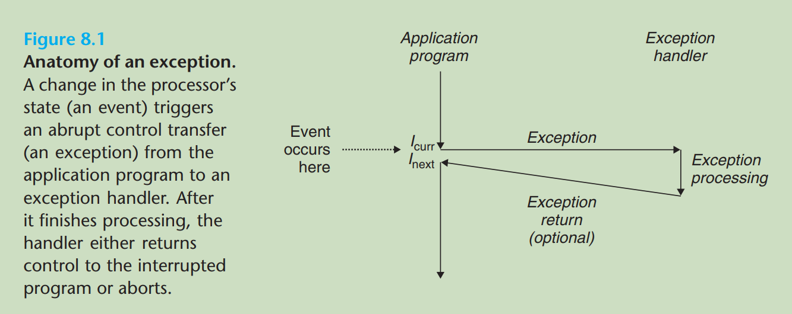
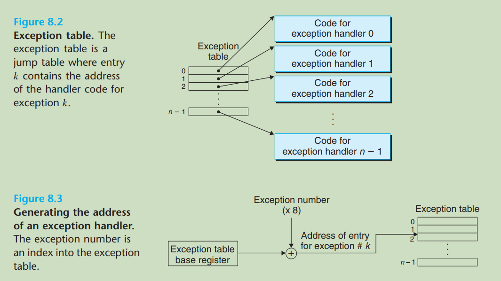
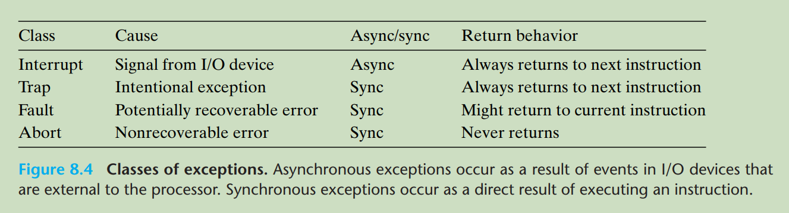
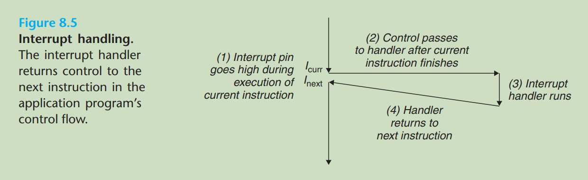
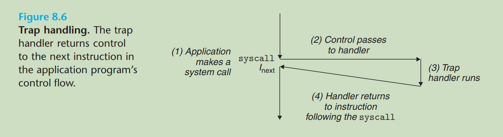
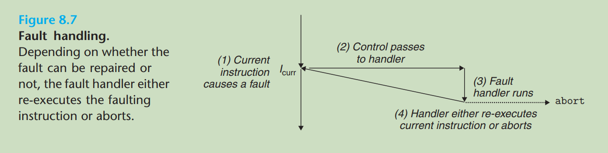
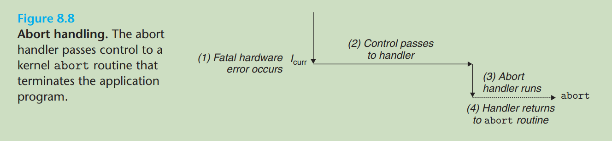
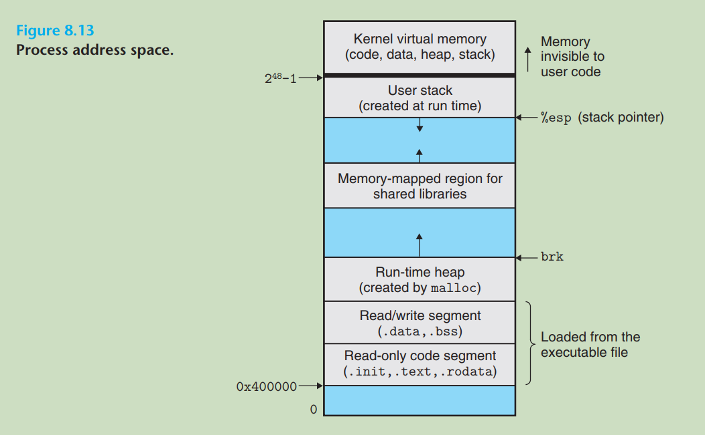

[toc]

# Exceptional Control Flow

从给处理器加电到断电为止，程序计数器 PC 中的值形成了一个 a~1~, a~2~, ..., a~n-1~ 的序列。其中 a~k~ 表示指令 I~k~ 的地址，从 a~k~ 到 a~k+1~ 的变化称为 **控制转移 (control transfer)** 。上边的序列称为处理器的 **控制流 (control flow)** 。

通过使用跳转、分支、调用和返回指令，程序可以根据由程序变量表示的内部程序状态的变化来改变控制流（表现为指令 I~k~ 和 I~k+1~ 在内存中不相邻），但是这种控制流的变化只局限于程序内部。

同时，系统也必须对系统状态的变化做出反应，比如数据从磁盘或网络适配器到达、指令除以零和系统计时器到时等。这类控制流的突变统称为 **异常控制流 (exceptional control flow, ECF)** 。ECF 机制发生在系统的各个层次：硬件层（硬件检测到的事件触发异常处理程序）、操作系统层（系统调用，进程上下文切换，信号）、应用层（C 语言中的 setjmp 和 longjmp 函数，C++ 和 Java 语言中的 try-catch 机制，Go 语言中的 panic 和 recover 函数，Python 语言的 try-except 机制）。

# 1. （硬件）异常

**异常(exception)** 是控制流的突变，用来响应处理器状态的某些变化。处理器的 **状态(state)** 在处理器中被编码为不同的位和信号，状态的变化也称为 **事件(event)** 。事件既可能和当前执行的指令有关（虚拟内存缺页，算术溢出，除以零），也可能无关（系统定时器产生的信号，I/O 请求完成）。

### 1.1 异常处理

异常处理的基本思想如下图所示。任何情况下处理器检测到有事件发生时，它通过 **异常表(exception table)** 执行间接过程调用，到一个专门处理此类事件的称为 **异常处理程序(exception handler)** 的操作系统子程序中处理异常，然后根据异常类型执行后续操作（1.2 节）。



系统中每种可能的异常都被分配了一个唯一的称为 **异常号(exception number)** 的非负整数，它被用作异常表的索引。当系统启动时，操作系统会分配和初始化一张异常表，表的起始地址放在 **异常表基址寄存器(exception table base register)** 中，而表项 k 则存放异常 k 的处理程序的地址。当处理器检测到事件发生时，它首先生成异常处理程序的地址，然后转到相应的处理程序。



所以，异常的处理是由硬件和软件合作完成的。硬件负责触发异常和生成异常处理程序的地址，剩下的工作由异常处理程序完成。

### 1.2 异常分类

异常分类概览：



##### 1.2.1 中断

**中断(interrupt)** 是 **异步(asynchronously)** 发生的，异步的含义是中断不是由任何一条专门的指令的执行造成的。中断的异常号用于标识引发中断的设备，用于处理中断的异常处理程序称为 **中断处理程序(interrupt handler)** 。



##### 1.2.2 陷阱

**陷阱(trap)** 是通过执行一条指令而引发的 **有意的(intentional)** 异常，它最重要的用途是 **系统调用(system call)** 。从程序员的角度来看，系统调用和普通的函数调用是一样的，但是系统调用运行在内核模式而普通函数调用运行在用户模式。



##### 1.2.3 故障

**故障(fault)** 是执行一条指令时出现的错误情况，它有可能被故障处理程序修复，也可能会造成当前程序终止。

最典型的故障是 **缺页异常(page fault)** 。当指令引用的虚拟地址对应的物理页面不在内存中时会发生缺页异常，然后缺页处理程序会从磁盘中加载页面并将控制返回给当前指令重新执行。



##### 1.2.4 终止

**终止(abort)** 是执行指令时发生的不可恢复的致命错误。异常处理程序会将控制交给 `abort` 例程，该例程会终止程序。



### 1.3 异常实例

在 x86-64 系统上有高达 256 种异常，其中 [0-31](https://wiki.osdev.org/Exceptions) 是由英特尔架构师定义的，32-255 则对应操作系统定义的陷阱和中断。对于陷阱，在 Linux 操作系统上有几百个系统调用（[完整列表](https://github.com/torvalds/linux/blob/master/arch/x86/entry/syscalls/syscall_64.tbl)）可供使用，它们都可以使用 `syscall` 指令来调用。而 C 标准库则提供了对这些系统调用的包装，我们将系统调用和与它们相关联的包装函数统称为 **系统级函数(system-level function)** 。下面是使用 `syscall` 打印 "hello, world\n" 的例子：

```assembly
# 文件名：hello.s
# 所有 Linux 系统调用的参数都通过寄存器传递
# 寄存器 %rax 包含系统调用号
# 寄存器 %rdi, %rsi, %rdx, %r10, %r8, %r9 依次存放最多六个参数
# 返回值放在 %rax 寄存器，负数表示发生错误
# 在 Linux 系统上依次输入下面两条命令
#   gcc -c hello.s
#   ld -o hello hello.o
# 然后输入 ./hello 运行就可以在控制台打印出 Hello, world! 字符串
.data

msg:
  .ascii "Hello, world!\n"
  len = . - msg

.text
  .global _start

_start:
  movq  $1, %rax   # write is system call 1
  movq  $1, %rdi   # arg1: stdout has file descriptor 1
  movq  $msg, %rsi # arg2: "Hello, world!\n" string
  movq  $len, %rdx # arg3: length of string
  syscall          # make the system call

  movq  $60, %rax  # _exit is system call 60
  movq  $0, %rdi   # arg1: exit status is 0
  syscall          # make the system call

```

# 2. 进程

### 2.1 进程概述

**进程(process)** 的经典定义是 **一个执行中程序的实例(an instance of a program in execution)** 。系统中的每个程序都运行在某个进程的 **上下文(context)** 中，上下文指的是程序正确运行所需的状态，包括内存中的程序代码和数据、栈、通用寄存器、程序计数器、环境变量和打开的文件描述符的集合。进程的关键是它为应用程序提供了两个关键抽象：

- **一个独立的逻辑控制流(An independent logical control flow)**
- **一个私有的地址空间(A private address space)**

一个程序执行时形成的 PC 值序列称为 **逻辑控制流(logical control flow)** 。一个物理控制流可以被划分成多个逻辑控制流，从而多个进程可以 **轮流地** 使用处理器。进一步地，如果一个逻辑流的执行在时间上和另一个逻辑流重叠，则称它们为 **并发流(concurrent flow)** ，并且它们 **并发地(concurrently)** 运行。

```
逻辑流 X 和 Y 并发运行的精确定义是：(X 在 Y 开始之后和结束之前开始) 或者 (Y 在 X 开始之后和结束之前开始)。
注意：
并发的思想和处理器核数或计算机数无关，只要两个流在时间上有重叠它们就是并发的。
进一步地，如果它们运行在不同的处理器核或计算机上，我们就称它们是并行流(parallel flow)。
所以，并行流是并发流的一个真子集。
```

进程为每个程序提供私有地址空间抽象，造成一种它好像在独占地使用系统地址空间的假象。私有的含义是物理上和某个进程的某个虚拟地址相关联的内存字节是不能被其他进程读或写的。Linux 上的进程地址空间组织如下：



为了实现完美的进程抽象，处理器需要限制程序能执行的指令和可以访问的地址空间，这通常是使用某个控制寄存器中的 **模式位(mode bit)** 来实现的。当该位被设置时，进程运行在 **内核模式(kernel mode)** 。运行在内核模式的进程可以执行任何指令、访问内存中的任意位置；否则，进程运行在 **用户模式(user mode)** 。处于用户模式的进程不允许执行 **特权指令(privileged instruction)** ，也不允许访问内核区的代码和数据。

<font color = red>进程从用户模式变为内核模式的唯一方式是通过诸如中断、故障和陷入系统调用这样的异常。</font>

进程之间的轮流运行（多任务）通过 **上下文切换(context switch)** 机制来实现，这是一种建立在[第一部分](#1. （硬件）异常)所描述的低层异常机制上的异常控制流。上下文切换由以下 3 步组成：

1. 保存当前进程的上下文
2. 恢复某个先前被抢占的进程的上下文
3. 将控制传给新恢复的进程

### 2.2 准备工作 —— 对系统调用进行错误处理

在 Unix 系统级函数执行出错时，它们通常返回 -1 并设置全局整型变量 `errno` 的值来表示什么出错了。程序员总是应该检查错误，但是过多的错误处理往往会使代码变得臃肿。所以我们跟随 Richard Stevens 的指导，定义类似于下面的错误处理包装函数来包装基本函数：

```c
void unix_error(char *msg)
{
	fprintf(stderr, "%s: %s\n", msg, strerror(errno));
	exit(0);
}

pid_t Fork(void)
{
	pid_t pid;
	if ((pid = fork()) < 0)
		unix_error("Fork error");
	return pid;
}
```

后续的代码都会使用类似于 `Fork` 这样的包装函数。
