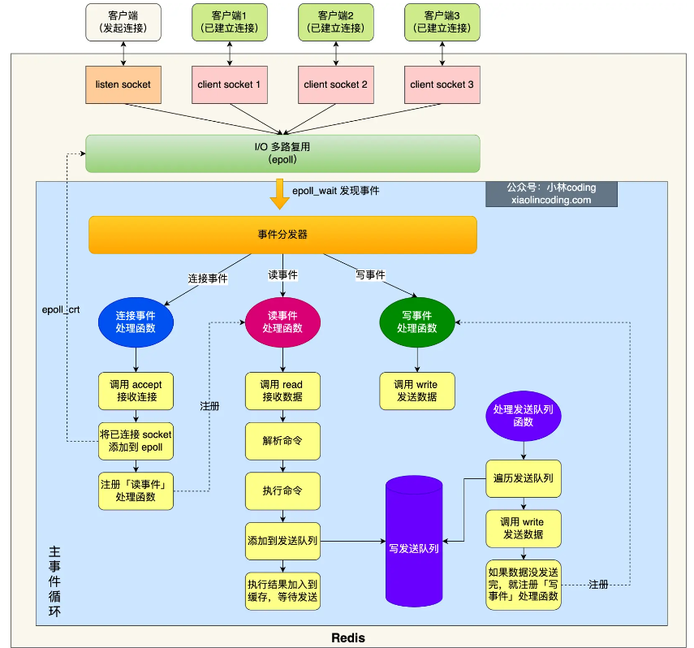

[toc]

# 介绍

- Redis 对数据的读写都在内存中完成，常用于缓存、消息队列、分布式锁。
- 优点：支持更丰富的数据类型、持久化、集群、发布订阅、事务。

# 数据结构

|     数据类型     |                   实现方式                   |         应用场景         |
| :--------------: | :------------------------------------------: | :----------------------: |
| 字符串（String） |            SDS：二进制和 API 安全            | 缓存对象、计数、分布式锁 |
|   列表（List）   |    压缩列表或双向链表 <- 3.2 -> quicklist    |         消息队列         |
|   哈希（Hash）   | 压缩列表（Redis 7.0 之后为listpack）或哈希表 |     缓存对象、购物车     |
|   集合（Set）    |               整数集合或哈希表               |  聚合（并、交、差）计算  |
| 有序集合（Zset） |  压缩列表（Redis 7.0 之后为listpack）或跳表  |         排序场景         |

# 单线程模型

- Redis 单线程：接收客户端请求 -> 解析请求 -> 进行数据读写操作 -> 发送数据给客户端（即 Redis 的核心工作：网络 I/O 和执行命令）的过程由单个线程完成。

- Redis 还会启动其他的后台线程：Redis 2.6 会启动关闭文件和 AOF 刷盘两个后台线程；Redis 4.0 之后新增了 lazyfree 后台线程用来释放内存。每个线程都对应一个各自的任务队列。

- Redis 单线程详解

  

- Redis 快的原因：高效的数据结构、基于内存的操作、避免多线程竞争和切换、 I/O 多路复用机制。

- Redis 6.0 之前使用单线程的原因：性能瓶颈更多在于内存大小和网络 I/O 而不是 CPU 数量、单线程可维护性更高。

- Redis 6.0 之后引入了多线程：为了提高网络 I/O 的并行度，使用多线程处理网络 I/O 而命令执行仍采用单线程，而且默认情况下只针对发送响应数据（write client socket）采用多线程。

# 集群

TODO

# 持久化

- 持久化方式：AOF 日志、RDB 快照和混合方式（Redis 4.0 新增）。

- AOF 日志：在执行完命令后将该命令写到 AOF 日志中。

  优点：避免额外检查开销、不会阻塞当前命令执行。

  过程：server.aof_buf 缓冲区 -> write 系统调用 -> 内核缓冲区 -> 磁盘。

- AOF 写回策略：控制从内核缓冲区到磁盘的时机。

  | 写回策略 |   写回时机   |   优点   |         缺点         |
  | :------: | :----------: | :------: | :------------------: |
  |  Always  |   同步写回   | 可靠性好 |    开销大降低性能    |
  | EverySec |   每秒写回   | 性能适中 | 宕机时丢失一秒内数据 |
  |    No    | 操作系统控制 |  性能好  | 宕机时会丢失很多数据 |

- AOF 重写：AOF 文件大小超过阈值时会进行 AOF 重写，由后台子进程 bgrewriteaof 完成，读取所有键值对并转换成一条 SET 命令。

- RDB 快照：使用 SAVE 和 BGSAVE 命令保存内存的二进制格式的全量快照。执行 bgsave 时主线程仍然可以继续执行命令修改数据，关键技术在于[写时复制](https://imageslr.com/2020/copy-on-write.html)。

- 混合持久化：工作在 AOF 重写过程。与主线程共享的数据以 RDB 方式写入 + 重写缓冲区里的增量命令以 AOF 日志的方式写入。结合了 RDB 恢复快和 AOF 丢失数据少的优点。

# 过期删除

- 过期删除策略：键的过期时间的实现方式 —— 过期字典。

  惰性删除：每次访问 key 时检测，如果过期则删除。CPU友好 VS 内存不友好。

  定期删除：每隔一段时间随机检查一定量的 key，如果过期则删除。

- 持久化时对过期键的处理：

  RDB —— 持久化时进行检查确保不保存过期键。

  AOF —— AOF 写入阶段时会保留，如果删除则追加一条 DEL 命令；AOF 重写阶段时会进行检查，不保存过期键。

- 主从模式下的过期键：从库不会进行过期扫描。当主库在 key 到期时，会在 AOF 文件里增加一条 DEL 命令，同步到所有的从库。

# 内存淘汰

- 内存淘汰：当 Redis 的运行内存达到我们设置的最大运行内存时触发内存淘汰机制。

  1. **不淘汰**：noeviction -> 直接停止服务返回错误。

  2. **只淘汰设置过期时间的数据**：volatile-*

     random -> 随机；ttl -> 按 TTL 从小到大；lru -> 最久未使用；lfu -> 最少使用。

  3. **在所有数据范围内进行淘汰**：allkeys-*

     random -> 随机；lru -> 最久未使用；lfu -> 最少使用。

# 缓存

- 缓存雪崩

  是什么？大量缓存数据在**短时间内过期**导致大量请求直接访问数据库，导致数据库压力骤增

  怎么做？随机打散缓存失效时间 + 缓存不过期

- 缓存击穿

  是什么？**热点（频繁访问的）数据过期**导致对热点数据的请求都打到数据库

  怎么做？互斥锁 + 缓存不过期

- 缓存穿透

  是什么？用户访问的数据**既不在缓存中也不在数据库中**

  为什么？业务误操作 or 黑客恶意攻击

  怎么做？限制非法请求 + 设置返回空值或默认值 + 使用布隆过滤器快速判断数据是否存在

- 动态缓存热点数据的缓存策略

  通过最新访问时间排序并定期淘汰一定量的数据

- 缓存更新策略

  1. Cache Aside（旁路缓存）（实际开发中 Redis 和 MySQL 唯一能使用的策略）适用于**读多写少**场景

     原理：应用程序**与缓存和数据库直接交互**来维护缓存

     写：更新数据库 -> 删除缓存数据

     读：命中缓存 -> 返回；否则读取数据库 -> 然后写入缓存

  2. Read/Write Through（读穿/写穿）

     原理：应用程序**只和缓存**交互

     写：缓存中存在 -> 更新缓存 -> 由缓存同步更新到数据库；缓存中不存在 -> 直接更新数据库

     读：缓存中存在 -> 返回；缓存中不存在 -> 由**缓存负责查询数据库**并将结果写入缓存

  3. Write Back（写回）适用于**写多**场景但存在**一致性和数据丢失**问题

     原理：更新数据时**只更新缓存**并设置脏位，数据库采用**批量异步更新**

# 实战

- 延迟队列：使用有序集合的 `score` 属性
- 管道技术：一次处理多个 Redis 命令，处理后将结果一起返回给客户端。这是客户端提供的功能
- 使用 `MULTI` 命令开启事务，使用 `DISCARD` 放弃事务，Redis 不支持事务回滚
- 分布式锁：
